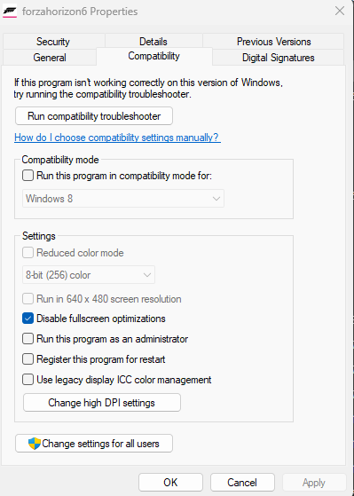
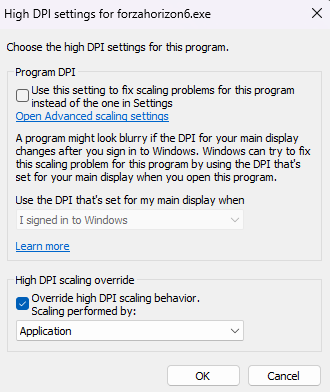

# 🎮 Forza Horizon 6 Skill Point Automator

A visually interactive, virtual-controller-based automator for **Forza Horizon 6**. Designed to run seamlessly in the background using Windows Virtual Desktops so you can farm skill points while continuing to use your PC.

It displays a beautiful, real-time Xbox controller HUD overlay showing active buttons and countdown timers.

---

## ✨ Key Features

*   **📺 Translucent HUD Overlay:** A floating, frameless, and translucent UI built with PyQt5 that stays on top of your screen or game capture.
*   **💡 Live Input Visualization:** Watch buttons, triggers, and thumbsticks light up dynamically as the script executes.
*   **⏯️ Interactive Control:** Toggle the automation on or off directly from the HUD using the built-in Play/Pause button.
*   **🎮 Virtual Controller Emulation:** Utilizes `vgamepad` to emulate a hardware Xbox 360 controller. This registers as native controller input to bypass anti-cheat keyboard/mouse detection.
*   **💻 Multitasking-Friendly:** Designed to run in a separate virtual desktop, allowing you to use your main workspace for other tasks.

---

## 🛠️ Environment Configuration

To run the automator successfully in the background, configure your game and compatibility settings as detailed below.

### 1. Steam Launch Options
To allow background controller input and visual captures, configure the game to run in borderless windowed mode.

> [!IMPORTANT]
> 1. Right-click **Forza Horizon 6** in Steam -> Select **Properties...**
> 2. In the **Launch Options** field under the **General** tab, paste:
>    ```text
>    -windowed -noborder -fullscreen=false
>    ```

### 2. Windows Executable Compatibility Settings
Adjust the compatibility settings of `forzahorizon6.exe` (found in `"C:\Program Files (x86)\Steam\steamapps\common\ForzaHorizon6"` or via Steam: **Manage** -> **Browse local files**).

| Feature / Setting | Instructions | Visual Guide |
| :--- | :--- | :--- |
| **Disable Fullscreen Optimizations** | Right-click `forzahorizon6.exe` -> **Properties** -> **Compatibility** -> Check **Disable fullscreen optimizations**. |  |
| **Override High DPI Scaling** | Click **Change high DPI settings** -> Check **Override high DPI scaling behavior** -> Set **Scaling performed by:** to `Application`. |  |

---

## 📦 Installation & Dependencies

The automator requires Python 3 and two external libraries.

### Command Line Installation:
```bash
pip install PyQt5 vgamepad
```

> [!WARNING]
> **Virtual Gamepad Driver Required**  
> `vgamepad` relies on the **ViGEmBus** system driver to emulate hardware controllers. If the script fails to run or complains about missing drivers, download and install it from the official [ViGEmBus Releases](https://github.com/ViGEm/ViGEmBus/releases).

---

## 🚀 Step-by-Step Setup Guide

Follow this sequence to set up background farming:

1. **Launch the Game:** Open Forza Horizon 6.
2. **Configure Virtual Desktops:**
   * Press `Win + Tab` to open the Windows Task View.
   * Create a new virtual desktop.
   * Drag the Forza Horizon 6 window into this new virtual desktop.
   * Switch to the new virtual desktop using `Ctrl + Win + Left/Right Arrow`.
3. **Run the Script:**
   * Open a command prompt/PowerShell in this directory and execute:
     ```powershell
     python auto_forza_skill_points.py
     ```
4. **Load the Farm Event:**
   * Go to the event browser in Forza Horizon 6 and search using **Share Code:** `409 742 297`.
   * Start the event.
5. **Begin Automation:**
   * Click the Play button (▶) on the floating Xbox controller overlay to start farming.
6. **Minimize/Switch Desktop:**
   * Switch back to your primary virtual desktop (`Ctrl + Win + Left/Right Arrow`) to work or play other games. 
   * *Optional:* You can capture or monitor the automator desktop using **OBS Studio** (Window Capture mode).

---

## ⚙️ Customizing the Automation Sequence

You can customize the button presses and delays by editing the `LOOP_SEQUENCE` array at the top of the [auto_forza_skill_points.py](file:///c:/Users/carlo/Documents/scripts/Forza/auto_forza_skill_points.py) script.

```python
# Edit this sequence to change button presses and timings:
LOOP_SEQUENCE = [
    {"type": "hold_rt"},                         # Hold Right Trigger (accelerator)
    {"type": "press", "button": "A"},            # Press A button
    {"type": "wait",  "seconds": 30},            # Wait 30 seconds
    {"type": "press", "button": "X"},            # Press X button
    {"type": "wait",  "seconds": .2},            # Wait 0.2 seconds
    {"type": "press", "button": "A"},            # Press A button
    {"type": "wait",  "seconds": 7},             # Wait 7 seconds
    {"type": "press", "button": "A"},            # Press A button
]
```

### Action Configuration Matrix

Use the following action types inside your custom `LOOP_SEQUENCE`:

| Action Type | Description | Schema & Custom Options |
| :--- | :--- | :--- |
| `hold_rt` | Holds the accelerator (RT) trigger down. | `{"type": "hold_rt"}` |
| `release_rt` | Releases the accelerator (RT) trigger. | `{"type": "release_rt"}` |
| `wait` | Pauses sequence execution. | `{"type": "wait", "seconds": N}` |
| `press` | Presses and releases a specific gamepad button. | `{"type": "press", "button": "A", "hold": 0.1}` *(default hold: 0.1s)* |

> [!TIP]
> **Supported Buttons for the `press` Action:**  
> `A` • `B` • `X` • `Y` • `LB` • `RB` • `START` • `BACK` • `GUIDE` • `LSTICK` • `RSTICK` • `DPAD_UP` • `DPAD_DOWN` • `DPAD_LEFT` • `DPAD_RIGHT`